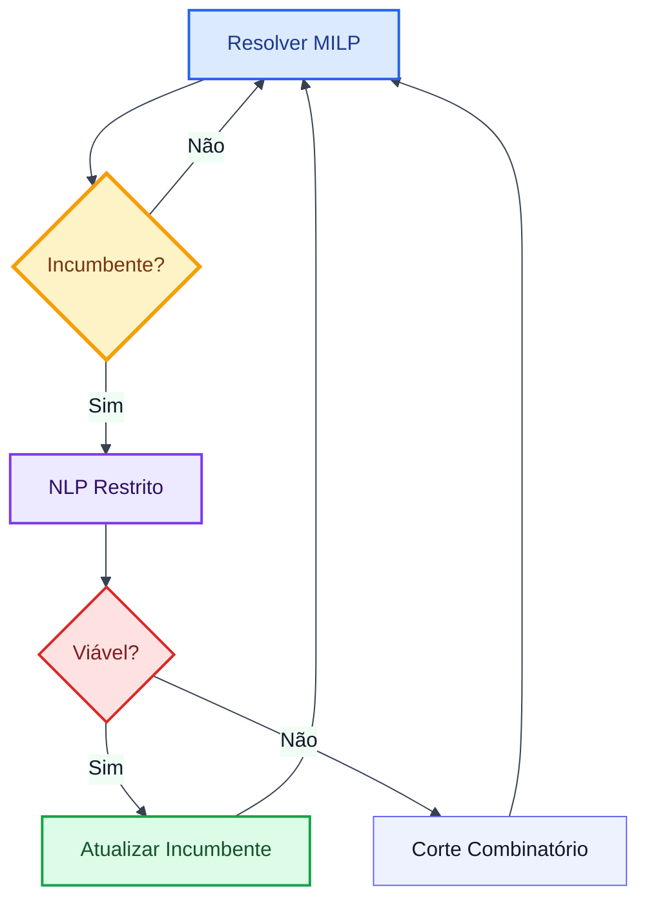

# Otimização de Bombeamento em Redes de Distribuição de Água

Uma Abordagem LP/NLP baseada em Branch and Bound

Bonvin, G. | Demassey, S. | Lodi, A. (2021) | slides/bonvin2021pump.md

---

## O Desafio do Agendamento de Bombas

A otimização diária do funcionamento de bombas sob tarifas elétricas dinâmicas busca minimizar custos de energia garantindo pressão e demanda.

- **Formulação Matemática**: MINLP (Mixed Integer Non-Linear Programming) não convexa.
- **Não Convexidade**: Leis de conservação física de pressão/vazão em tubulações e bombas.
- **Decisões Discretas**: Status das bombas e válvulas ativas (Ligado/Desligado).

O principal desafio é resolver o MINLP sem incorrer em aproximações grosseiras ou em modelos grandes demais para os solvers convencionais.

---

## Modelagem Matemática: O Real $(\mathcal{P})$ vs. A Relaxação $(\mathcal{P}_\epsilon)$

### Modelo Real Não Convexo $(\mathcal{P})$

- **Perda de Carga nos Tubos** (Fricção quadrática):
  $$h_{it} - h_{jt} = A_l q_{lt} + B_l q_{lt} |q_{lt}|$$
- **Ganho de Pressão na Bomba** (Curva não-linear):
  $$h_{jt} - h_{it} = w_{kt}^2 \left( \alpha_k - \beta_k \left( \frac{q_{kt}}{w_{kt}} \right)^{\gamma_k} \right)$$
- **Consumo de Energia** (Cúbico/Não-linear):
  $$\Gamma_k(q_{kt}, w_{kt}) = w_{kt}^2 (\lambda_k w_{kt} + \mu_k q_{kt})$$

### Relaxação Convexa Poliédrica $(\mathcal{P}_\epsilon)$

- **Tubos** (Relaxa igualdade para inequação convexa):
  $$(q_{lt}, h_{it} - h_{jt}) \in P_l^\epsilon \quad (\text{tangentes e secantes})$$
- **Bombas** (Superestimadores lineares $\Pi^*$):
  $$h_{jt} - h_{it} \le \Pi^*(q_{kt}, w_{kt}) + M(1 - x_{kt})$$
- **Consumo** (Subestimadores lineares $\Pi_*$):
  $$y^1_{kt} \ge \text{tangentes da rotação}, \quad y^2_{kt} \ge \text{planos } \Pi_*$$

---

## A Contribuição: $\epsilon$-Outer Approximation

O artigo propõe uma relaxação MILP (Mixed Integer Linear Programming) tratável e de tamanho reduzido para as leis físicas não convexas.

- **Alternativa às Piecewise-Linear**: Elimina a necessidade de dezenas de variáveis binárias auxiliares para modelar segmentos de reta.
- **Aproximação Externa Poliédrica**: Constrói planos tangentes/secantes convexos externos às curvas reais com uma tolerância de erro máxima $\epsilon$.
- **Finitude e Tamanho**: Gera apenas o número necessário de planos para garantir a precisão sem sobrecarregar o solver MILP.

---

## O Fluxo do Branch and Bound LP/NLP

### Processo em Árvore Única

O método exato combina solvers MILP e NLP em uma única busca:

- **Resolver MILP**: O solver MILP busca candidatos globais inteiros.
- **NLP Restrito**: Ao encontrar uma solução inteira, um *lazy callback* invoca o NLP.
- **Validação Física**: O solver NLP valida as restrições reais e calcula o custo real.
- **Podagem / Corte**: Se for infactível, adiciona cortes combinatórios para podar a busca.

---

## Redes com Configuração Binária (BS)

Para redes compostas apenas por elementos com status discretos (bombas de velocidade fixa e válvulas liga/desliga), o método traz uma aceleração crítica:

- **Simulação Hidráulica**: Substitui o solver NLP por um resolvedor hidráulico rápido (método Todini-Pilati / motor similar ao EPANET).
- **Cortes Combinatórios**: Se a simulação for infactível (ex: estouro dos limites dos tanques), gera *no-good cuts* de Balas e Jeroslow.
- **Aceleração da Busca**: Impede o solver MILP de reexplorar configurações de bomba incorretas que causam transbordo.

---

## Ajuste de Passo de Tempo (Time-Step Adjustment)

Heurística primal desenvolvida para atenuar a rigidez da discretização temporal fixa (ex: 1 hora).

- **Princípio**: Divide cada passo temporal de 1 hora em 3 sub-passos para permitir a transição antecipada ou atrasada das bombas.
- **Objetivo**: Corrigir pequenas violações de limites de tanques permitindo que as bombas liguem ou desliguem minutos antes ou depois do planejado.
- **Resultado**: Produz agendas viáveis na prática sem precisar recorrer a modelos com passos de tempo muito pequenos (ex: 5 minutos), que seriam intratáveis.

---

## Avaliação e Resultados Numéricos

O método foi validado em um conjunto amplo e padronizado de benchmarks da literatura, cobrindo 75 instâncias geradas a partir de 5 redes.

- **Redes Testadas**: *Simple FSD/VSD*, *AT(M)* (Anytown modificado), *Poormond* (Richmond), e *DWG* (rede belga).
- **Desempenho**:
  - Superou solvers globais comerciais puros (como o BARON) em velocidade e qualidade de limitantes.
  - Eficiente e exato para redes binárias (BS).
  - Redes mistas (MS) com bombas de velocidade variável permanecem desafiadoras, mas o método oferece bons limitantes de performance.

---

## Referências

1. Bonvin, G.; Demassey, S.; Lodi, A. **Pump scheduling in drinking water distribution networks with an LP/NLP-based branch and bound**. *Optimization and Engineering*, v. 22, p. 1275–1313, 2021. DOI: [10.1007/s11081-020-09575-y](https://doi.org/10.1007/s11081-020-09575-y).
2. Rao, F.; Alvarruiz, F. **Use of genetic algorithms to optimize pump scheduling in water distribution systems**. *Journal of Water Resources Planning and Management*, 2007.
3. Walski, T. et al. **Battle of the network models: Anytown**. *ASCE Water Resources Planning and Management*, 1987.

---

<!-- _class: questions -->

## Perguntas?
